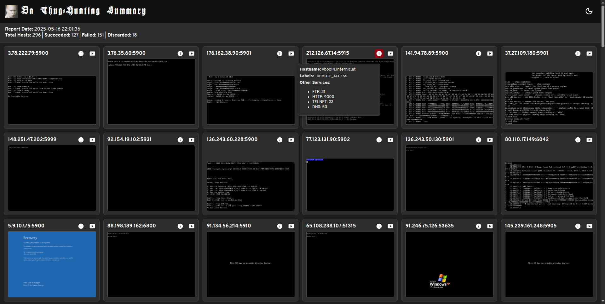

# ThugHunter

ThugHunter is a tool for querying the Censys platform to discover hosts with potentially interesting services. It scrapes and saves host data locally to optimize Censys credit usage. ThugHunter also allows users to check VNC hosts for password protection, view their snapshots, and analyze exposed services. The tool requires `chrome` and the `vncsnapshot` utility to function.



## Usage

1. Make sure you have [Go 1.23.4](https://go.dev/dl/) or newer installed.
2. Install the required dependencies: `chrome` and `vncsnapshot`.
3. Clone the repository:
  ```sh
  git clone https://github.com/smegg99/ThugHunter.git
  ```
4. Navigate to the app directory:
  ```sh
  cd ThugHunter/app
  ```
5. Run the application:
  ```sh
  go run .
  ```
